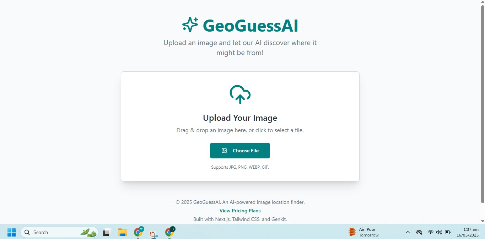
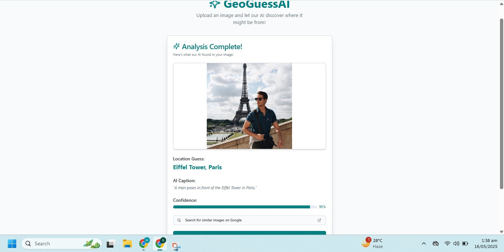
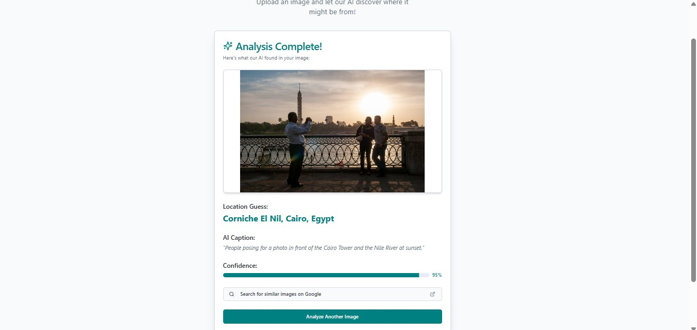
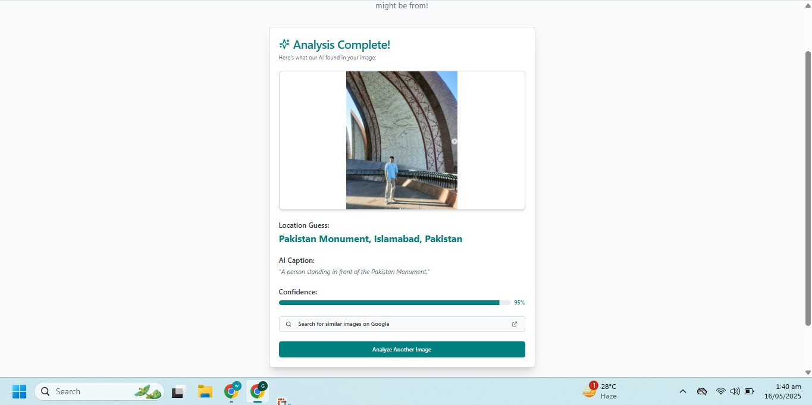

# 📍 GeoGuessAI  AI - Image Background Location Identifier

GeoVision AI is a SaaS  web application that allows users to upload any image and instantly discover where the background of the image is from , whether it's a city, landmark, restaurant, or any recognizable place. Inspired by tools like Google Lens, the app uses advanced AI models to interpret the image and guess its location with high accuracy.

---

## 🚀 Features

- 🌍 Detects locations in image backgrounds (e.g., cities, buildings, restaurants)
- 📸 Upload any image and get results in seconds
- 🧠 Uses state-of-the-art AI models (BLIP-2 / GPT-4 Vision + CLIP)
- 🔍 Returns a caption and best guess of the location
- ✨ Clean UI with responsive design

---

## 🖼️ Screenshots

| Upload Page | Result Page |
|-------------|-------------|
|  |  |
|  |  |
